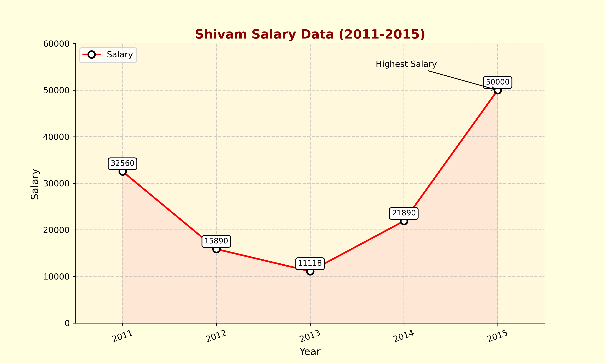
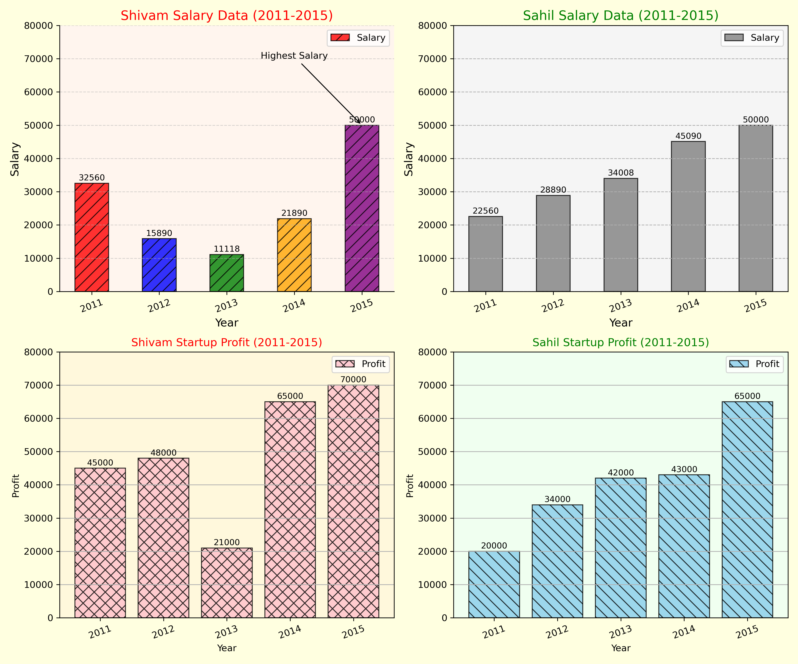
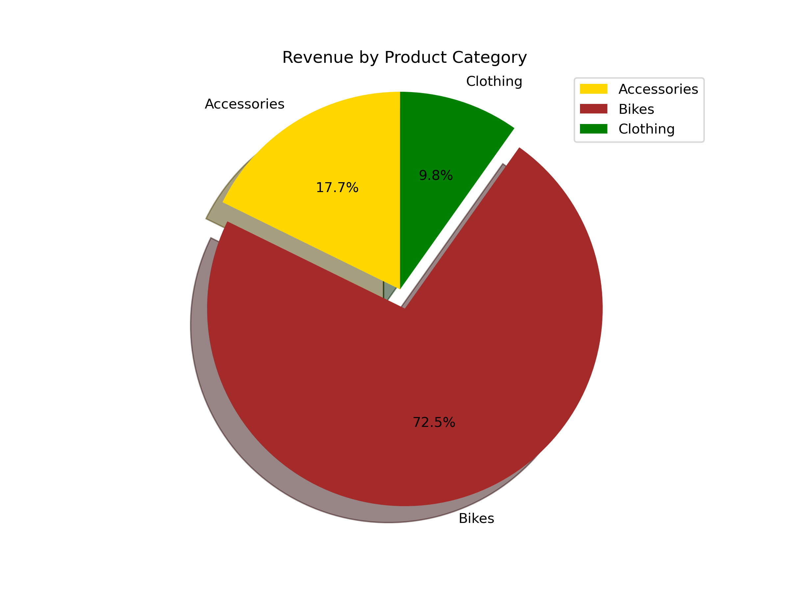
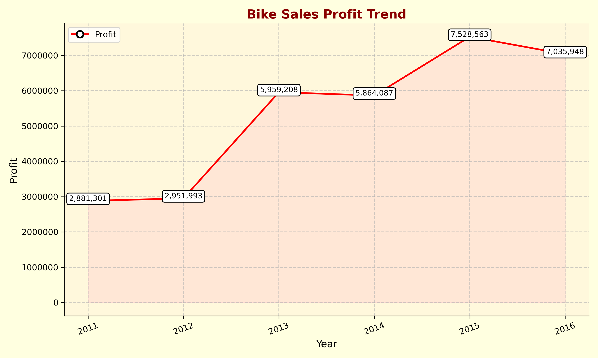
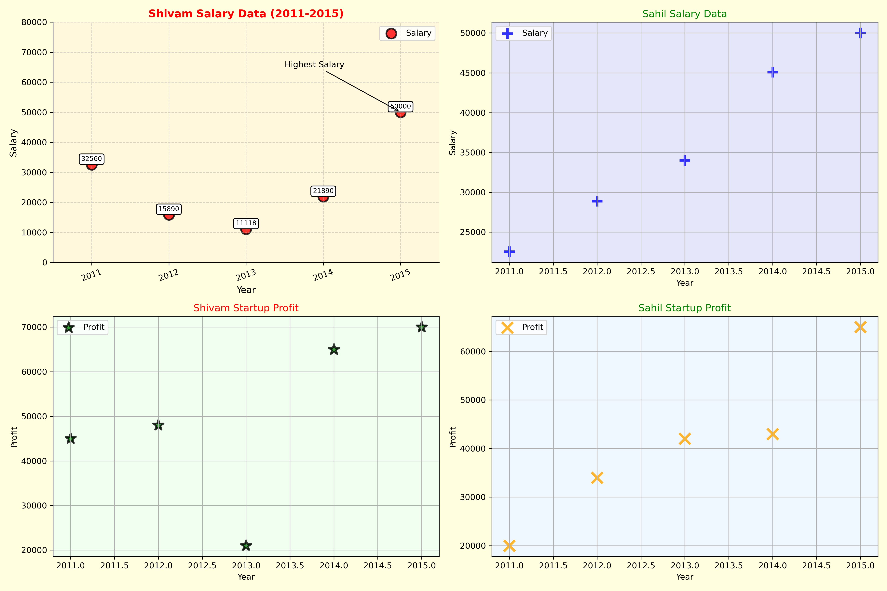
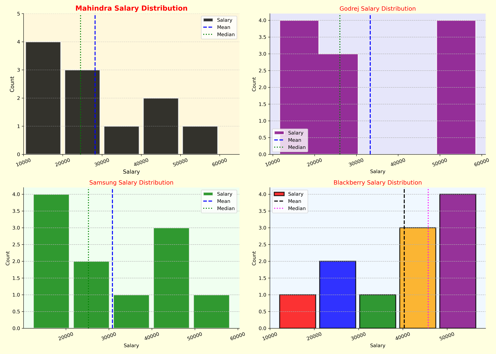
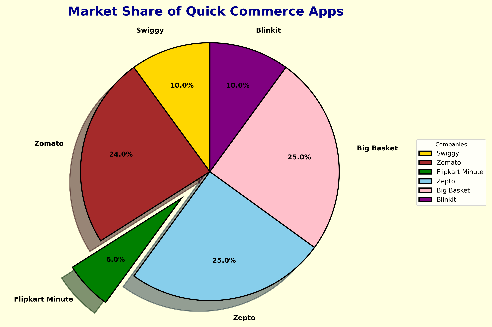

<p align="center">

</p>
<h1 align="center">📊 Matplotlib Learning</h1>

<p align="center">
  <b>A Complete Hands-on Guide to Data Visualization using Matplotlib</b><br><br>

  
  
  
  
</p>

---

# 📖 About

This repository contains my **complete Matplotlib learning journey** for **Data Visualization** using **Python & Jupyter Notebook**.

It includes beginner-to-intermediate plotting techniques with practical examples and real-world datasets to build a strong foundation in creating insightful visualizations.

---

# 🚀 Topics Covered

✔️ Introduction to Matplotlib

✔️ Line Charts

✔️ Bar Charts

✔️ Horizontal Bar Charts

✔️ Pie Charts

✔️ Histograms

✔️ Scatter Plots

✔️ Plot Customization

✔️ Colors & Styles

✔️ Titles & Labels

✔️ Legends

✔️ Grid

✔️ Figure Size

✔️ Multiple Plot Styling

✔️ Saving Figures

✔️ Real Dataset Visualization

---

# 🛠 Tech Stack

- Python
- Matplotlib
- Jupyter Notebook

---

# 📂 Charts Created

This repository includes practical visualization examples:

- 📈 Salary Line Chart
- 📊 Salary Bar Chart
- 🥧 Product Category Revenue Pie Chart
- 📉 Bike Sales Profit Trend
- 📌 Scatter Plot Analysis
- 📊 Histogram Report
- 🛒 Quick Commerce Market Share

---

# 🖼️ Sample Visualizations

## 📈 Salary Line Chart

<p align="center">

</p>

---

## 📊 Salary Bar Chart

<p align="center">

</p>

---

## 🥧 Product Category Revenue

<p align="center">

</p>

---

## 📉 Bike Sales Profit Trend

<p align="center">

</p>

---

## 📌 Scatter Plot

<p align="center">

</p>

---

## 📊 Histogram

<p align="center">

</p>

---

## 🛒 Quick Commerce Market Share

<p align="center">

</p>

---

# 📂 Repository Structure

```text
📦 Matplotlib-Learning
│
├── 📓 Matplotlib_Learning.ipynb
├── 🖼️ salary_line_chart.png
├── 🖼️ salary_bar_chart.png
├── 🖼️ Product_Category_Revenue_Pie.png
├── 🖼️ Bike_Sales_Profit_Trend.png
├── 🖼️ Scatter_Report.png
├── 🖼️ Histogram_Report.png
├── 🖼️ Quick_Commerce_MarketShare.png
└── 📄 README.md
```

---

# 🎯 Learning Outcomes

After completing this notebook, I gained practical experience in:

- 📌 Creating Professional Charts
- 📌 Customizing Plots
- 📌 Data Visualization Best Practices
- 📌 Styling Graphs
- 📌 Working with Multiple Chart Types
- 📌 Visual Storytelling using Data

---

# 🚀 Next Roadmap

- 📊 Seaborn
- 📈 Plotly
- 📉 Power BI
- 📊 Dashboard Projects

---

# ⭐ Support

If you found this repository useful,

**⭐ Star this repository**

and feel free to fork it for your own learning.

---

<div align="center">

### 👨‍💻 Shivam Upadhayay

**B.Tech (Artificial Intelligence & Data Science)**

**Happy Coding & Data Visualization! 📊🚀**

</div>
